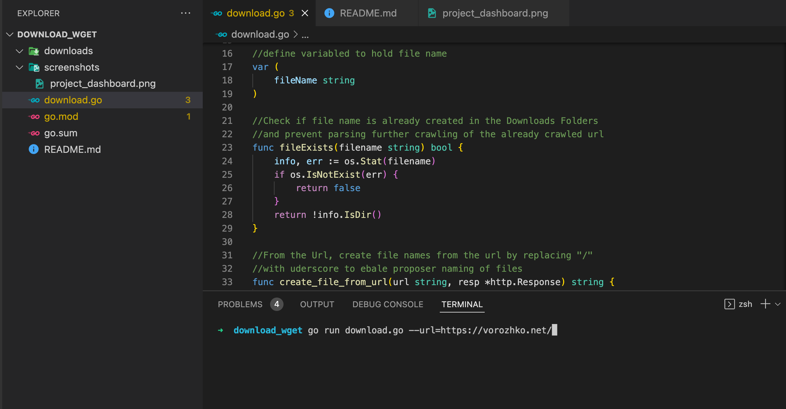
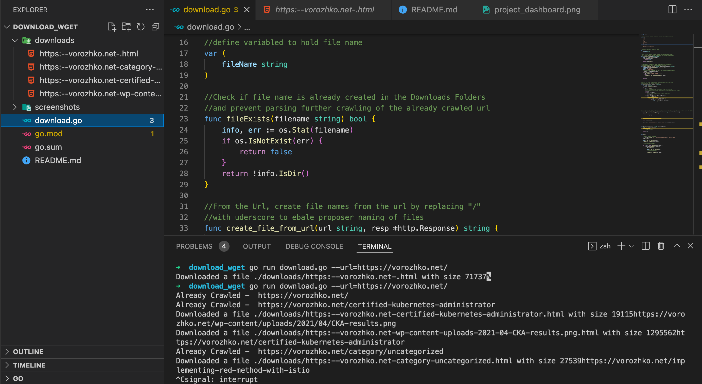

This a project to crawl the webpage provided via a command line. This project Implement a recursive, mirroring web crawler. 

<h2>How to RUN</h2> 

From the Command Line, Type <strong>go run download.go --url=https://vorozhko.net</strong>

<strong>See Screenshot below</strong>

   

<h2>Download Folder</h2>

This Folder Contains all the pages crawled and Saved into a file for each url

<h2>Command Line Output</h2>

Command Line Output of Pages Crawled and Parsed

 

 <h2>Chelule Kemboi Maina</h2>
