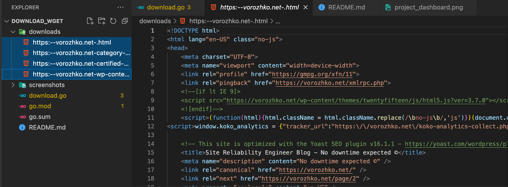

This a project to crawl the webpage provided via a command line. This project Implement a recursive, mirroring web crawler. 

<h2>How to RUN</h2> 

From the Command Line, Type <strong>go run download.go --url=https://vorozhko.net</strong>

<strong>See Screenshot below</strong>

   

<h2>Download Folder</h2>

This Folder Contains all the pages crawled and Saved into a file for each url

<h2>Command Line Output</h2>

Command Line Output of Pages Crawled and Parsed

 

 <h2>Chelule Kemboi Maina</h2>

Missing Features
1. Storing crawlers output into the database to make the contents Dynamic and editable
 
Given more time, i would impliment the following
1. Organize my directory structures as per the query Strings and store the respective contents into the spscific directory.
2. Autoreplace the urls of each href tags with local IP address or local domain so that I have the entire hyperlinks localy working just like a complete web.
3. Impliment DBMS storage mechanism as opposed to file Systems
